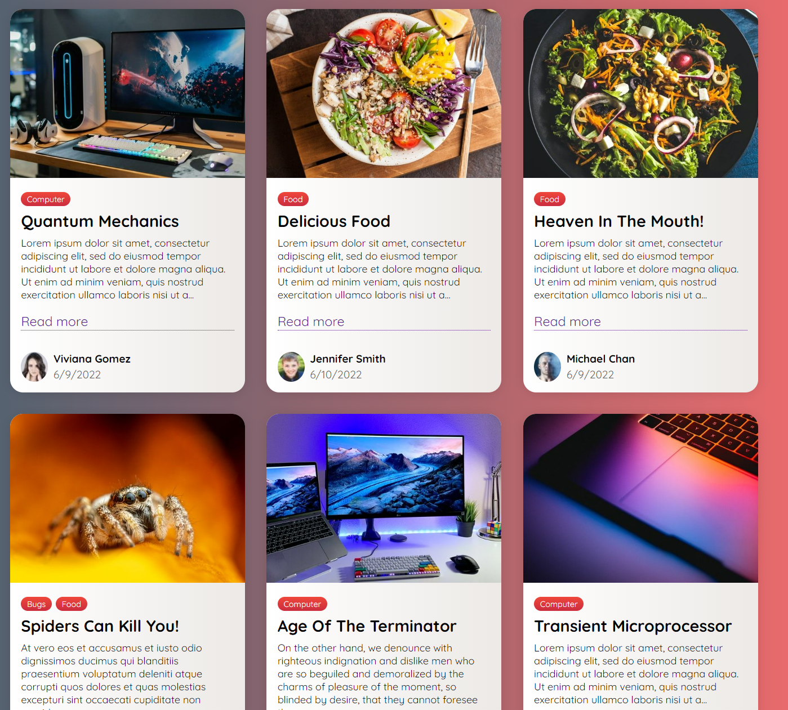

# Headless Content Management System with Strapi



This repo works in conjunction with Strapi to create a full stack blogging website. Please have a basic understand of Strapi before you get started. https://strapi.io/

Strapi is a headless CMS. If the body is the server and the head is the client, think of chopping off the head and you're left with just the backend. Strapi is useful to rapidly create artifacts and assets in a content registry that can easily be pulled using RESTful API or GraphQL. In this repo, I built a React UI that interacts with Strapi.


### ⏳ Installation (from the Strapi Github page)

Install Strapi with this **Quickstart** command to create a Strapi project instantly:

- (Use **yarn** to install the Strapi project (recommended).

```bash
yarn create strapi-app my-project --quickstart
```

**or**

- (Use npm/npx to install the Strapi project.)

```bash
npx create-strapi-app my-project --quickstart
```

### Procedure
1. Run Strapi and create collection types (review, category, comment)
1. Create multiple entries for blogging
1. Run this app `npm run start`


